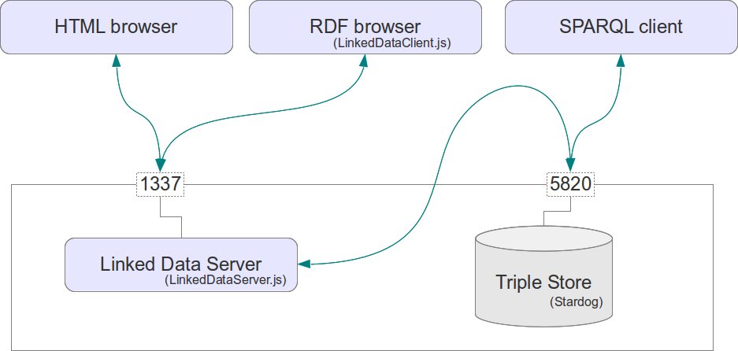
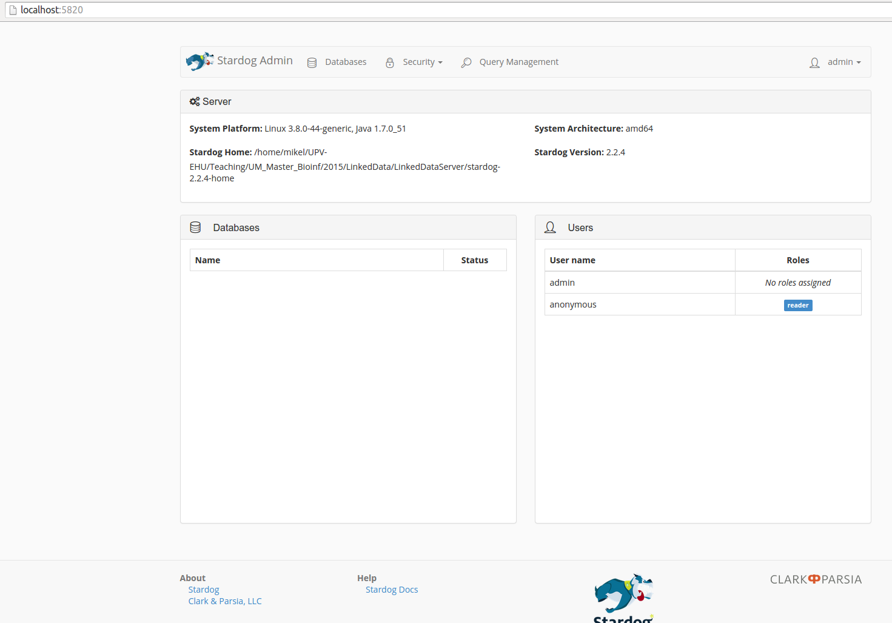

LinkedDataServer
================

About
-----

[Linked Data](http://en.wikipedia.org/wiki/Linked_data) is a set of principles to publish data directly on the web: 

1. Use URIs to denote things.
2. Use HTTP URIs so that these things can be referred to and looked up ("dereferenced") by people and user agents.
3. Provide useful information about the thing when its URI is dereferenced, leveraging standards such as RDF, SPARQL.
4. Include links to other related things (using their URIs) when publishing data on the Web.

The most important bit when providing data in Linked Data is that we use URIs to identify things, and when an agent (web browser or agent) requests the entity, we pass a different representation as a result of [content negotiation](http://en.wikipedia.org/wiki/Content_negotiation) (RDF, HTML, ...). That way, an agent can browse the data "serendipiously", much as we do when we browse the Web. Also, as data will be codified in RDF triples, it is easy to integrate, specially if common ontologies are used to publish the data. Therefore, the web becomes a sort of [Universal Data Base](http://lod-cloud.net/).

In order to teach about Linked Data, I have created this Linked Data Server, so students can publish data at localhost and understand Linked Data publishing and consumption. It includes a Triple Store ([Stardog](http://stardog.com/)) and a [NodeJS](https://nodejs.org/) script (LinkedDataServer.js) for content negotiation with web agents/browsers. This is a tool for teaching, not production. The setting is very insecure and fragile, but its aim is to learn the basics of (Life Sciences) Linked Data, not programming nor web security. 

I used to teach Linked Data with [Jena-Fuseki, Jetty and Pubby (LSLD)](https://github.com/mikel-egana-aranguren/LSLD), but I realized that students spent too much time configuring Pubby and got rapidly lost in technical details. Hopefully, since the Web server is just a NodeJS script, students will not get lost in configuration, and, even more, they will be able to easily modify the Linked Data Server. In fact, since this is my first shot at JavaScript and NodeJS, LinkedDataServer.js is horrible, so forks and pull requests in order to improve it are more than wellcome. 

Structure
---------

This bundle follows the usual architecture for Linked Data Systems, with changes w.r.t LSLD:

* Triple Store: Stardog instead of Jena-Fuseki. I find it easier to work with.
* Web server: NodeJS instead of Jetty. Way easier.
* Linked Data broker: LinkedDataServer.js instead of Pubby. Pubby is much better, flexible and complete, but its configuration is also more complex. 



Installation (Ubuntu 12.04 LTS)
-------------------------------

Clone this repository.

Download Stardog and a community key (for free), or download only the key. Create a directory called `stardog-3.0-home` and add your key there.

Install NodeJS (`apt-get install nodejs`) and then install [Stardog.js](https://github.com/clarkparsia/stardog.js) by following the instructions provided. I had an issue and fixed it [like this](http://askubuntu.com/questions/353853/how-to-update-coffee-script/#answer-360720), but perhaps you don't encounter such a problem.

Deployment
----------

Export STARDOG_HOME and PATH env variables for comfort (adjust `/home/you/foo/bar/` to your path):

`export STARDOG_HOME=/home/you/foo/bar/LinkedDataServer/stardog-3.0-home`

`export PATH=/home/you/foo/bar/LinkedDataServer/stardog-3.0/bin:$PATH`

Start stardog at port 5820:

`stardog-admin server start --port 5820`

You whould see something like this if you go with your browser to http://localhost:5820/:



Create a Data Base called `um`:

`stardog-admin db create -n um`

Add data:

`stardog data add um data/data.rdf data/data2.rdf data/ontology.owl`

In the Stardog Web interface, if you go to `databases` and click on `um` and then on `query` (user admin, password admin, very insecure), you should see a SPARQL form. Execute the following query:

`describe <http://genomic-resources.eu/resource/Prot_A>`

You should see something like this:


Execute LinkedDataServer.js (you can change the port in the script at `var port=1337;` also, if Stardog is runing in another port, you can change it at `var endpoint_url = "http://localhost:5820/";`):

`nodejs LinkedDataServer.js`

Go to http://127.0.0.1:1337/resource/Prot_B, you should see something like this: 


If you click on internal links like http://genomic-resources.eu/resource/Prot_A you should see a similar interface, with links to external datasets. 

You can test content negotiation by simulating you are an agent that wants a stream of RDF/XML data:

`curl --header "accept: application/rdf+xml" http://127.0.0.1:1337/resource/Prot_B`

You should obtain RDF:

```
<?xml version="1.0" encoding="UTF-8"?>
<rdf:RDF
	xmlns:rdf="http://www.w3.org/1999/02/22-rdf-syntax-ns#">

<rdf:Description rdf:about="http://genomic-resources.eu/resource/Prot_B">
	<label xmlns="http://www.w3.org/2000/01/rdf-schema#">Protein B</label>
	<rdf:type rdf:resource="http://genomic-resources.eu/ontology/Protein"/>
	<codified_by xmlns="http://genomic-resources.eu/resource/" rdf:resource="http://genomic-resources.eu/resource/Gene_B"/>
	<sameAs xmlns="http://www.w3.org/2002/07/owl#" rdf:resource="http://purl.uniprot.org/uniprot/P08251"/>
	<differentFrom xmlns="http://www.w3.org/2002/07/owl#" rdf:resource="http://genomic-resources.eu/resource/Prot_A"/>
	<part_of xmlns="http://genomic-resources.eu/ontology/" rdf:resource="http://genomic-resources.eu/resource/Mitochondrion"/>
</rdf:Description>

</rdf:RDF>
```

You can also request the HTML, simulating you are a Web browser:

`curl --header "accept: text/html" http://127.0.0.1:1337/resource/Prot_B`

And you should obtain HTML:

```
<p><a href="http://127.0.0.1:1337/resource/Prot_B">http://genomic-resources.eu/resource/Prot_B</a> - <a href="http://a">a</a> - <a href="http://127.0.0.1:1337/ontology/Protein">http://genomic-resources.eu/ontology/Protein</a></p>
<p><a href="http://127.0.0.1:1337/resource/Prot_B">http://genomic-resources.eu/resource/Prot_B</a> - <a href="http://127.0.0.1:1337/resource/codified_by">http://genomic-resources.eu/resource/codified_by</a> - <a href="http://127.0.0.1:1337/resource/Gene_B">http://genomic-resources.eu/resource/Gene_B</a></p>
<p><a href="http://127.0.0.1:1337/resource/Prot_B">http://genomic-resources.eu/resource/Prot_B</a> - <a href="http://http://www.w3.org/2002/07/owl#sameAs">http://www.w3.org/2002/07/owl#sameAs</a> - <a href="http://http://purl.uniprot.org/uniprot/P08251">http://purl.uniprot.org/uniprot/P08251</a></p>
<p><a href="http://127.0.0.1:1337/resource/Prot_B">http://genomic-resources.eu/resource/Prot_B</a> - <a href="http://http://www.w3.org/2002/07/owl#differentFrom">http://www.w3.org/2002/07/owl#differentFrom</a> - <a href="http://127.0.0.1:1337/resource/Prot_A">http://genomic-resources.eu/resource/Prot_A</a></p>
<p><a href="http://127.0.0.1:1337/resource/Prot_B">http://genomic-resources.eu/resource/Prot_B</a> - <a href="http://127.0.0.1:1337/ontology/part_of">http://genomic-resources.eu/ontology/part_of</a> - <a href="http://127.0.0.1:1337/resource/Mitochondrion">http://genomic-resources.eu/resource/Mitochondrion</a></p>

```

What happens here is the usual Linked Data practice: there is a SPARQL endpoint hosting the RDF triples, and the Linked Data Server performs SPARQL `describe` queries to retrieve entities requested by the client. The server then produces HTML or RDF/XML, depending on the request from the client.

The content negotiation implemented is deliberately very limited to make it easy to understand: 

* The server only deals with two `accept` HTTP headers: `accept: text/html` for web browsers and `accept: application/rdf+xml` and web agents. Pubby, for example, offers many more possibilities.
* The content negotiation process is the simplest possible: other processes can be implemented (e.g. 303 redirection). More information on Linked Data content negotiation can be found at the [Linked Data book](http://linkeddatabook.com/editions/1.0/#htoc11), [the W3C note "Cool URIs for the Semantic Web"](http://www.w3.org/TR/cooluris/#solutions), and many other resources.   

The Linked Data server is hosted at localhost (your own machine, not the Web server to which http://genomic-resources.eu/ points to), therefore all the requests of the form `http://127.0.0.1:1337/...` are mapped to the actual resources stored in Stardog, i.e. `http://genomic-resources.eu/...`. The URIs stored in Stardog are mapped back when rendering HTML, but not when providing RDF (See bugs in this repo). A possible solution would be to use an RDF dataset containing `http://127.0.0.1:1337/...` URIs but that is not very Linked Data, specially if we add a port number to the URI!  


